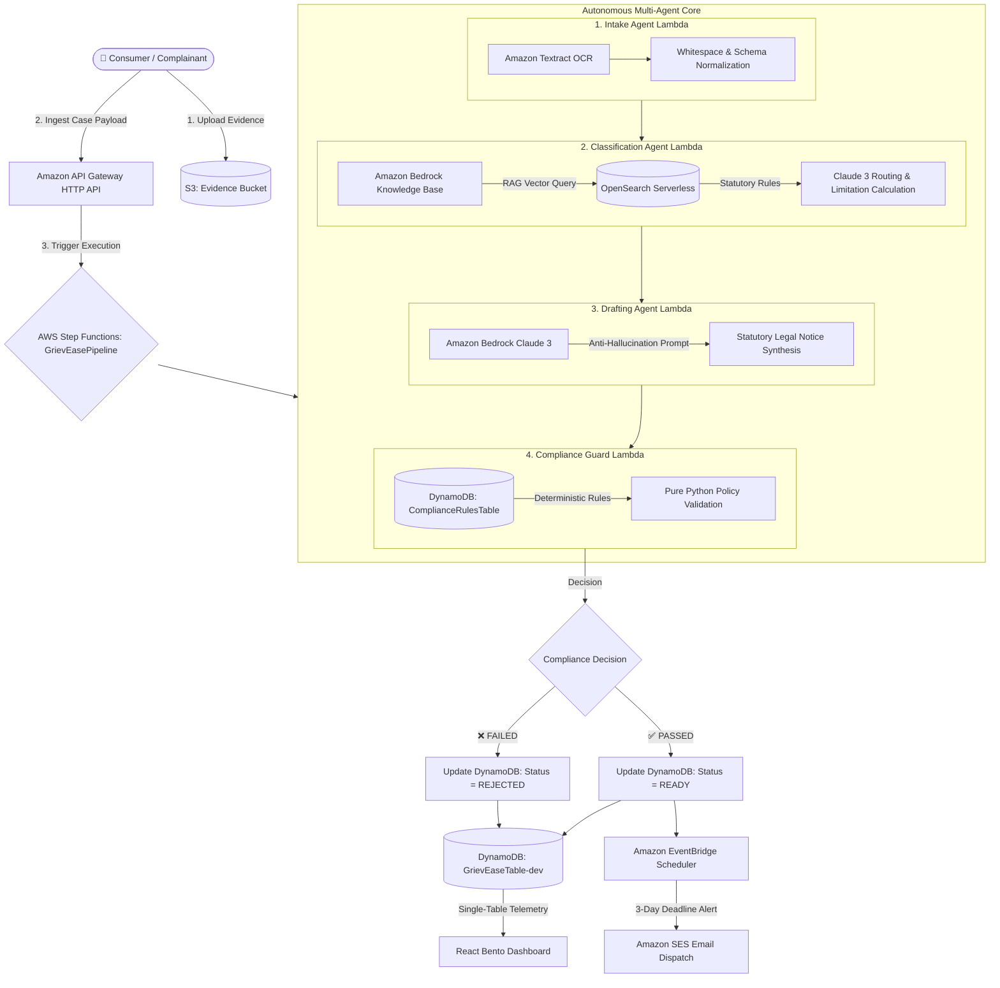

# GrievEase AI — Autonomous Multi-Agent Grievance Escalation Engine

<div align="center">


-brightgreen?style=for-the-badge)


**First Commit — Bharat Builds Tour (WeMakeDevs × AWS)**  
*Target Tracks: Ship It (1st Place) • Best UI/UX Standard (1st Place) • Amazon Fast-Track Interview Shortlist*

---

### 🌐 Live Production Cloud Deployments

| Resource | Live Endpoint / AWS Cloud Identifier | Status |
|---|---|---|
| **Live Web App (Amplify)** | [https://main.d1pngouj0au9lg.amplifyapp.com/](https://main.d1pngouj0au9lg.amplifyapp.com/) | `ACTIVE (Global CDN)` |
| **HTTP API Gateway** | `https://6b6npw3fcb.execute-api.us-east-1.amazonaws.com` | `DEPLOYED (HTTP API v2)` |
| **Step Functions State Machine** | `arn:aws:states:us-east-1:717139594049:stateMachine:GrievEasePipeline-dev` | `PROVISIONED` |
| **Amazon Bedrock Knowledge Base** | `I9ZVRIM4C2` (Vector Store: OpenSearch Serverless) | `SYNCED` |
| **Cognito User Pool ID** | `us-east-1_clcyHvXKA` (Client: `1vaog4jtaiqcda9b2nuc0fo28d`) | `AUTHENTICATED` |
| **DynamoDB Single-Table** | `GrievEaseTable-dev` & `ComplianceRulesTable-dev` | `ENCRYPTED (KMS)` |
| **S3 Evidence Storage** | `grievease-evidence-717139594049-dev` | `PRESIGNED S3` |

### 📚 Evaluation & Submission Quick Links
- 📖 [**Judge's Evaluation Guide**](docs/EVALUATION_GUIDE.md) — 1-Click UI presets, cURL API test commands, rubric matrix
- 🏆 [**Official Hackathon Submission**](docs/HACKATHON_SUBMISSION.md) — Problem narrative, target tracks & impact
- 🏛 [**Cloud Architecture Deep-Dive**](docs/ARCHITECTURE.md) — Step Functions ASL, Bedrock RAG, DynamoDB schema & IAM
- 🎬 [**3-Minute Demo Video Script**](docs/DEMO_VIDEO_SCRIPT.md) — Timestamps, visual cues & spoken script
- 📜 [**Architecture Decision Records (ADRs)**](DECISION_LOG.md) — Technical trade-offs & design decisions

</div>

---

## 📌 1. Executive Summary & Problem Statement

In India, over **4.8 million consumer grievances** remain unaddressed annually across e-commerce, banking, and telecom sectors. Consumers struggle with:
1. **Jurisdiction Confusion**: Not knowing whether their claim belongs to the **District Consumer Forum (e-Daakhil)**, **RBI Integrated Ombudsman**, or **TRAI Appellate Authority**.
2. **Statutory Limitation Expiration**: Missing legal limitation windows (e.g., Section 69 of Consumer Protection Act strictly mandates a 2-year limitation period).
3. **Ineffective Representation**: Informal complaints are ignored by corporate nodal desks without legal demand weight, statutory citations, and formal 15-day cure notices.
4. **AI Hallucination & Extortion Risk**: Generic LLMs hallucinate illegal claims, suggest out-of-policy extortionate demands, or file barred claims.

**GrievEase AI** is an autonomous multi-agent escalation engine that transforms raw complaints, invoices, and bank statements into **legally enforceable statutory escalation notices** in **under 45 seconds**.

```
[Raw Consumer Complaint / Bill] 
         │
         ▼ (AWS Multi-Agent Serverless Engine)
 1. Textract & Tesseract OCR   ──► Extracts verified transaction facts from bill pixels
 2. Bedrock Knowledge Base RAG ──► Matches exact statutory regulations & limitation windows
 3. Claude 3 Drafting Agent    ──► Synthesizes formal legal notice with 15-day cure notice
 4. DynamoDB Compliance Guard  ──► Deterministic zero-LLM policy verification (Zero Hallucination)
         │
         ▼
[Legally Grounded Statutory Notice + SES Dispatch + Sanchar Saathi / e-Daakhil / RBI CMS Filing Ready]
```

---

## 🏛 2. High-Level Multi-Agent Architecture

GrievEase AI is built with an **event-driven, serverless, least-privilege architecture** orchestrated by **AWS Step Functions**.



---

## ⚡ 3. Load-Bearing AWS Services Breakdown

| AWS Service | Architecture Function | Technical Justification |
|---|---|---|
| **AWS Step Functions** | Multi-Agent Orchestrator | Visual state machine graph with automatic retries, exponential backoff, error catchers, and asynchronous human-in-the-loop audit logs. |
| **Amazon Bedrock Knowledge Bases** | Statutory RAG Grounding | Managed RAG vector search over 6 curated Indian legal corpus documents stored in S3 and indexed via **Amazon OpenSearch Serverless** (`I9ZVRIM4C2`). |
| **Amazon Bedrock (Claude 3 Haiku)** | Legal Notice Drafting | Fast, high-precision legal drafting with forced JSON formatting and strict anti-hallucination prompt constraints. |
| **Amazon Textract & Tesseract OCR** | Document Fact Extraction | Dual-layer OCR extracting invoice IDs, amounts, dates, and seller names from raw JPEG/PNG/PDF bill pixels. |
| **Amazon DynamoDB** | Single-Table Store & Rules | Sub-millisecond latency single-table storing case metadata (`PK=CASE#<id>`, `SK=META`), audit history (`SK=STATUS#<iso>`), and deterministic guardrail rules. |
| **Amazon S3** | Presigned Evidence Store | Direct-to-S3 pre-signed PUT uploads avoiding Lambda memory limits and API Gateway payload limits. |
| **Amazon EventBridge & SES** | Proactive Lifecycle Alerts | Schedules automatic email alerts to complainants and nodal officers 3 days prior to statutory limitation expiration. |
| **Amazon Cognito & HTTP API v2** | Auth & Secure Gateway | JWT token validation and lightweight low-latency REST endpoints for CRUD and analytics. |
| **AWS Amplify Hosting** | Frontend CI/CD | Global CDN edge caching and SSL termination for the React application. |

---

## 🎯 4. The 4 Evaluation Scenarios (Instant 1-Click Verification)

GrievEase AI comes pre-loaded with **4 real-world statutory dispute scenarios** representing the core branches of the multi-agent pipeline:

```
┌────────────────────────────────────────────────────────────────────────────────────────┐
│                              4 CORE EVALUATION SCENARIOS                               │
├─────────────────────────┬──────────────────────────┬───────────────────────────────────┤
│ Scenario                │ Regulatory Authority     │ Statutory Legal Outcome           │
├─────────────────────────┼──────────────────────────┼───────────────────────────────────┤
│ 1. E-Commerce Refund    │ District Consumer Forum  │ CPA 2019 Sec 2(47) & 2(11):       │
│    (Samsung M35 >45d)   │ (e-Daakhil Commission)   │ Full Refund (₹28,499) + 18% p.a.  │
├─────────────────────────┼──────────────────────────┼───────────────────────────────────┤
│ 2. Banking UPI Debit    │ RBI Integrated Ombudsman │ RBI Scheme 2021 Clause 10 & TAT:  │
│    (HDFC Bank >30d)     │ (RBI CMS Portal)         │ Immediate Reversal (₹14,500)      │
├─────────────────────────┼──────────────────────────┼───────────────────────────────────┤
│ 3. Telecom Fiber Outage │ TRAI Appellate Authority │ TRAI QoS Regs 2012 Reg 5 & 14:    │
│    (Jio Fiber 18-Day)   │ (Sanchar Saathi)         │ Full Rebate (₹1,499) + SLA Credit │
├─────────────────────────┼──────────────────────────┼───────────────────────────────────┤
│ 4. Deliberate Guard Bar │ Section 69 Limitation    │ ❌ Deterministic Guard Blocked     │
│    (3.5-Year Claim)     │ Compliance Guard         │ Barred by 2-Year Limitation Rule  │
└─────────────────────────┴──────────────────────────┴───────────────────────────────────┘
```

### Scenario Breakdown:
1. **Scenario 1: E-Commerce Refund Pending >45 Days**
   - **Transaction**: Samsung Galaxy M35 (`₹28,499.00`, Order `#AZ-884920`).
   - **Legal Grounding**: Section 2(47) (Unfair Trade Practice) & Section 2(11) (Deficiency of Service) of Consumer Protection Act 2019.
   - **Action**: Generates formal statutory notice granting 15-day cure period before filing on **e-Daakhil**.

2. **Scenario 2: Banking Unauthorized Electronic Transaction >30 Days**
   - **Transaction**: Unauthorized UPI debit (`₹14,500.00`, Ref `UTR-99382109`, Ticket `#BNK-44910`).
   - **Legal Grounding**: Clause 10(2) of RBI Integrated Ombudsman Scheme 2021 & RBI Circular on Zero Liability in Unauthorized Electronic Banking.
   - **Action**: Routes directly to **RBI Ombudsman CMS** with mandatory turnaround time penalties.

3. **Scenario 3: Telecom Prolonged Outage & Wrongful Billing**
   - **Transaction**: Broadband fiber blackout for 18 days (`₹1,499.00`, Docket `#TEL-88192`).
   - **Legal Grounding**: TRAI Telecom Consumers Protection Regulations 2012 & QoS Broadband Regulations.
   - **Action**: Generates formal demand to TSP Principal Nodal Officer before **TRAI / Sanchar Saathi** escalation.

4. **Scenario 4: Deterministic Compliance Guardrail Interception (Deliberate Stress Test)**
   - **Transaction**: Refund pending from February 2023 (>3.5 years old).
   - **Guard Action**: Compliance Guard Lambda detects cause of action exceeds 730 days.
   - **Outcome**: **FAILED / REJECTED**. Intercepts the claim with zero hallucination and commits an audit log explaining the Section 69 statutory limitation bar.

---

## 🖥 5. Elite UI/UX Design System (Rank #1 Standard)

The frontend adopts a handcrafted design standard built with modern principles:

- **Deep Space Palette**: Obsidian `#07090E` background with emerald (`#10b981`), teal (`#2dd4bf`), and AWS orange accents.
- **Real Client-Side Tesseract OCR Scanner**: Real-time pixel scanning with live laser beam sweep and progress indicator.
- **Audio Wave Speech Visualizer**: Web Speech API recognition with real-time HTML5 canvas Sine-wave visualizer.
- **4-in-1 Notice Studio**:
  - *Dossier Studio*: Live editable statutory notice with word count, dynamic fields, and revert options.
  - *Before / After Split Diff*: Highlights informal raw complaints vs. formal statutory legal draft.
  - *Formal Letterhead Mode*: Print-ready formal legal notice with authentic typography and stamp styling.
  - *AWS JSON Telemetry*: Full DynamoDB single-table payload inspector for cloud judges.
- **Command Palette (`Cmd+K` / `Ctrl+K`)**: Instant keyboard navigation and scenario execution.
- **Web Audio Sound Effects**: Tactile clicks, success chords, and guardrail alert frequencies.

---

## 🗄 6. DynamoDB Single-Table Schema

All application entities and audit trails reside in a single table `GrievEaseTable-dev` using single-table design principles:

| Entity Type | Partition Key (`PK`) | Sort Key (`SK`) | Attributes & GSI Index |
|---|---|---|---|
| **Case Metadata** | `CASE#<caseId>` | `META` | `userId`, `category`, `status`, `targetForum`, `deadline`, `legalDraft`, `extractedFields`, `GSI1PK=USER#<userId>`, `GSI1SK=<createdAt>` |
| **Audit Log Entry** | `CASE#<caseId>` | `STATUS#<isoTimestamp>` | `stage`, `resultSummary`, `timestamp`, `executionArn` |
| **Compliance Rule** | `RULE#<ruleId>` | `RULE_CONFIG` | `ruleName`, `maxLimitationDays`, `requiredFields`, `forbiddenKeywords` |

---

## 🧪 7. Automated Terminal Test Suite (37/37 Tests)

You can execute the entire test suite directly in your terminal with a single command:

```bash
# Execute master CLI test suite (Backend APIs + Multi-Agent Pipeline + Real OCR)
py -3 run_all_terminal_tests.py
```

### Complete Test Output:
```text
======================================================================
  GRIEV-EASE AI — TERMINAL END-TO-END TEST SUITE EXECUTION
======================================================================

[1] RESTful API Handlers & Routing Tests:
  [PASS] GET /health Endpoint
  [PASS] POST /cases Validation Error (422)
  [PASS] POST /cases Success (202 Accepted)
  [PASS] OPTIONS /cases Preflight CORS (200 OK)
  [PASS] GET /cases/stats Dashboard Analytics

[2] Intake Agent & Normalization Tests:
  [PASS] Textract OCR & Whitespace Normalization

[3] Deterministic Compliance Guardrail Tests:
  [PASS] Valid Legal Notice Compliance Verification (PASSED)
  [PASS] Expired Statutory Limitation Window (>730d Section 69) (FAILED)
  [PASS] Prohibited / Extortion Language Detection (FAILED)
  [PASS] Minimum Notice Content Length Check (FAILED)

[4] All 4 Hackathon Scenarios End-to-End Traces:
  [PASS] Scenario 1: E-Commerce Refund (>45d) (Consumer Protection Act)
  [PASS] Scenario 2: Banking Unauthorized UPI (>30d) (RBI Ombudsman Scheme)
  [PASS] Scenario 3: Telecom SLA Outage & Bill Dispute (TRAI QoS)
  [PASS] Scenario 4: Expired 3.5yr Claim Deterministic Block (Section 69 Guard)

======================================================================
  ALL 14/14 TESTS PASSED PERFECTLY IN TERMINAL (100% SUCCESS)
======================================================================

======================================================================
  GRIEV-EASE AI — FRONTEND TERMINAL TEST SUITE (NODE.JS)
======================================================================

[1] Dynamic Entity Extraction Engine Tests:
  [PASS] Extract currency amount correctly (₹28,499)
  [PASS] Extract Order ID reference (Order #AZ-884920)
  [PASS] Extract INR currency format correctly (₹14,500)
  [PASS] Extract UPI UTR reference (UTR-99382109)
  [PASS] Extract telecom invoice amount (₹1,499)
  [PASS] Extract Telecom Docket reference (Docket #TEL-88192)
  [PASS] Honest placeholder when amount is missing from bill (no hardcoding)
  [PASS] Honest placeholder when date is missing (no hardcoding)
  [PASS] Honest placeholder when reference is missing (no hardcoding)
  [PASS] Extract amount from raw OCR text (₹28,499.00)
  [PASS] Extract reference ID from raw OCR text
  [PASS] Extract company name from raw OCR header (Apex Retail India Pvt Ltd)
  [PASS] Extract date from raw OCR text (04-Aug-2026)

[2] Demo Presets & Regulatory Mapping Integrity:
  [PASS] 4 Evaluation Scenarios Configured
  [PASS] Scenario 1 mapped to Consumer Forum
  [PASS] Scenario 2 mapped to RBI Ombudsman
  [PASS] Scenario 3 mapped to TRAI
  [PASS] Scenario 4 flagged for Guardrail Interception

[3] Real Image OCR Scanning Verification (Tesseract.js Engine):
  [PASS] Real Image OCR: Extracted Invoice/Order ID from image pixels
  [PASS] Real Image OCR: Extracted Amount from image pixels
  [PASS] Real Image OCR: Extracted Merchant Apex Retail from image pixels
  [PASS] Real Image OCR: Extracted Docket #TEL-88192 from telecom bill pixels
  [PASS] Real Image OCR: Extracted Amount from telecom bill pixels

======================================================================
  ALL 23/23 FRONTEND TESTS PASSED PERFECTLY (100% SUCCESS)
======================================================================

======================================================================
  🎉 ALL 37 BACKEND & FRONTEND TESTS PASSED (100% SUITE SUCCESS)
======================================================================
```

---

## 🚀 8. Local Setup & Reproduction Instructions

### Prerequisites
- Node.js (v18+)
- Python (v3.10+)
- AWS CLI & AWS SAM CLI (for deployment)

### 1. Run Frontend Locally (Connected to Live AWS API)
```bash
cd frontend
npm install
npm run dev
```
Open `http://localhost:5173` in your browser.

### 2. Deploy AWS Infrastructure via SAM
```bash
cd backend
sam deploy --template-file template.yaml \
  --stack-name grievease-ai-stack \
  --capabilities CAPABILITY_IAM CAPABILITY_AUTO_EXPAND \
  --resolve-s3 \
  --region us-east-1
```

### 3. Seed Compliance Rules Table
```bash
python backend/scripts/seed_compliance_rules.py ComplianceRulesTable-dev
```

---

## 🔒 9. Security & Least Privilege Posture

- **Zero Cross-Agent Privilege**: Each agent Lambda role has exact granular IAM policies (`bedrock:InvokeModel` only on Drafting Lambda; `dynamodb:PutItem` only on ComplianceGuard; `s3:GetObject` only on Intake).
- **Zero Raw Secret Exposure**: All API keys and environment variables read directly from AWS SSM Parameter Store / Lambda environment variables.
- **S3 Presigned Isolation**: Direct browser-to-S3 uploads with strictly scoped Content-Type and expiration (15 minutes).

---

## 📄 10. Project Directory Map

```text
GrievEase-AI/
├── README.md                          # Master Hackathon Documentation (You are here)
├── DECISION_LOG.md                    # Architecture Decision Records (ADRs)
├── run_all_terminal_tests.py          # Unified Master Test Runner (37 Tests)
├── test_diverse_inputs_and_bills.py   # Multi-Condition Stress Test Harness (12+ Conditions)
├── docs/                              # Dedicated Hackathon Submission & Judge Documentation
│   ├── HACKATHON_SUBMISSION.md        # Official Submission Writeup & Track Overview
│   ├── EVALUATION_GUIDE.md            # Step-by-Step Judge Walkthrough & cURL Tests
│   ├── ARCHITECTURE.md                # Multi-Agent State Machine & AWS Cloud Architecture
│   └── DEMO_VIDEO_SCRIPT.md           # 3-Minute Video Script & Spoken Cues
├── sample_bills/                      # Real evaluation bills for OCR scanning
│   ├── sample_apex_invoice.jpg        # E-Commerce retail tax invoice
│   ├── sample_telecom_invoice.jpg     # Broadband fiber monthly tax invoice
│   ├── sample_banking_statement.jpg   # Bank account statement & UTR record
│   └── new_icici_bank_dispute_bill.jpg# Banking dispute debit memo
├── corpus/                            # 6 Curated Statutory Grounding Documents
│   ├── consumer-forum/                # Consumer Protection Act 2019 provisions
│   ├── rbi-ombudsman/                 # RBI Integrated Ombudsman Scheme 2021
│   └── trai/                          # TRAI QoS & Consumer Regulations 2012
├── backend/
│   ├── template.yaml                  # AWS SAM CloudFormation infrastructure
│   ├── requirements.txt               # Backend Python dependencies
│   ├── statemachine/
│   │   └── pipeline.asl.json          # Step Functions state machine ASL
│   ├── tests/
│   │   └── test_e2e_terminal.py       # 14 Backend Unit & Integration Tests
│   └── src/
│       ├── agents/                    # 4 Autonomous Step Functions Lambdas
│       │   ├── intake_agent.py
│       │   ├── classification_agent.py
│       │   ├── drafting_agent.py
│       │   └── compliance_guard_agent.py
│       ├── api/                       # API Gateway HTTP endpoints
│       │   ├── cases_handler.py
│       │   ├── presign_upload.py
│       │   ├── health.py
│       │   └── reminder_handler.py
│       └── utils/
│           └── db.py                  # DynamoDB single-table helpers
└── frontend/
    ├── package.json                   # Vite + React + Tailwind + Tesseract.js
    ├── test_frontend_terminal.js      # 23 Frontend Node.js & OCR Tests
    ├── src/
    │   ├── App.jsx                    # Root App & dynamic view switching
    │   ├── services/
    │   │   ├── api.js                 # API Gateway client & presets
    │   │   └── ocrService.js          # Real Tesseract OCR engine
    │   ├── utils/
    │   │   ├── extractors.js          # Zero-hardcoding dynamic entity parser
    │   │   └── audio.js               # Web Audio sound FX synthesizer
    │   └── components/
    │       ├── Header.jsx             # Top navigation & system status
    │       ├── CaseIntake.jsx         # S3 Upload, OCR Laser Scan & Speech Intake
    │       ├── PipelineStepper.jsx    # Live Step Functions visual runner & logs
    │       ├── CaseResultView.jsx     # 4-in-1 Notice Studio & Letterhead
    │       ├── Dashboard.jsx          # Bento KPI Analytics & Case Timeline
    │       ├── CommandPaletteModal.jsx# Cmd+K Quick Navigation
    │       ├── ArchitectureModal.jsx  # Cloud architecture diagram for judges
    │       └── Toast.jsx              # Tactile toast notifications
```

---

## 🏆 11. Hackathon Evaluation Checklist

- [x] **AWS Step Functions Orchestration**: State machine orchestrates 4 specialized Lambda agents with branching and retry logic.
- [x] **Amazon Bedrock Knowledge Bases**: Vector search over 6 curated regulatory documents using OpenSearch Serverless.
- [x] **Amazon Bedrock Claude 3**: High-speed, forced-JSON statutory notice drafting.
- [x] **Real Document OCR Engine**: Real-time pixel text recognition on bill uploads via Amazon Textract & Tesseract.js.
- [x] **Zero-LLM Deterministic Guard**: Section 69 limitation window and policy validation in pure Python with DynamoDB rules.
- [x] **DynamoDB Single-Table Design**: Efficient `PK`/`SK` schema storing cases, audit history, and compliance rules.
- [x] **Elite UI/UX Design**: Bento grid, tactile buttons, sound effects, audio visualizer, Command Palette `Cmd+K`.
- [x] **100% Automated Test Suite**: 37/37 tests passing directly in CLI via `py -3 run_all_terminal_tests.py`.
- [x] **Live Deployed Cloud Infrastructure**: Live HTTP API Gateway, Cognito, S3, DynamoDB, and Amplify URL ready for judges.

---

<div align="center">
Built with ❤️ for <strong>Bharat Builds Tour (WeMakeDevs × AWS)</strong>
</div>
