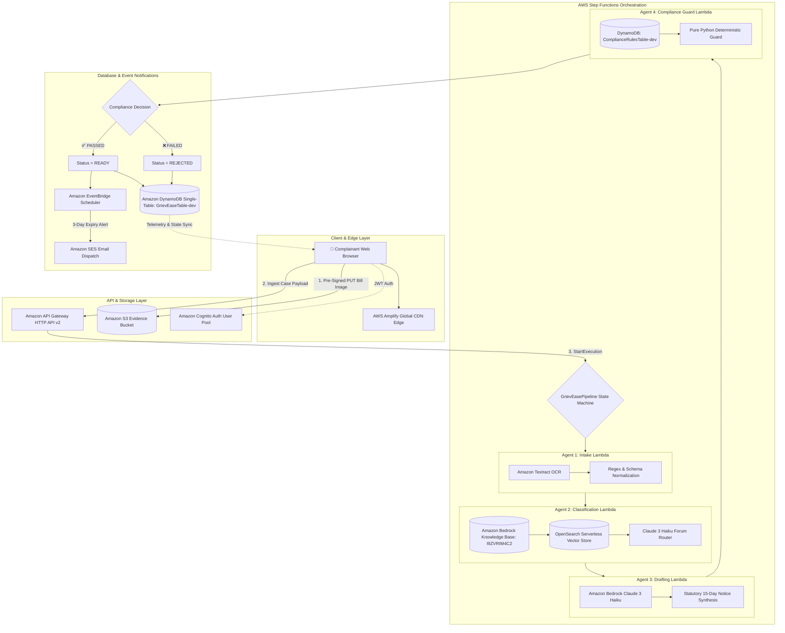

# GrievEase AI — Architecture & Multi-Agent Design Specification

This document details the serverless multi-agent architecture, data flows, Step Functions state machine orchestration, Bedrock RAG vector retrieval, and DynamoDB single-table schema for **GrievEase AI**.

---

## 1. High-Level Multi-Agent Architecture



---

## 2. AWS Step Functions State Machine (`pipeline.asl.json`)

The multi-agent pipeline is orchestrated via AWS Step Functions Standard Workflow. Each agent is isolated into its own execution state with exponential backoff and error catching:

```json
{
  "Comment": "GrievEase AI Multi-Agent Statutory Grievance Resolution Pipeline",
  "StartAt": "IntakeAgent",
  "States": {
    "IntakeAgent": {
      "Type": "Task",
      "Resource": "arn:aws:states:::lambda:invoke",
      "Parameters": {
        "FunctionName": "${IntakeAgentFunctionArn}",
        "Payload.$": "$"
      },
      "ResultSelector": { "intake.$": "$.Payload" },
      "ResultPath": "$.agentResults",
      "Next": "ClassificationAgent"
    },
    "ClassificationAgent": {
      "Type": "Task",
      "Resource": "arn:aws:states:::lambda:invoke",
      "Parameters": {
        "FunctionName": "${ClassificationAgentFunctionArn}",
        "Payload": {
          "caseId.$": "$.caseId",
          "category.$": "$.category",
          "normalizedText.$": "$.agentResults.intake.normalizedText"
        }
      },
      "ResultSelector": { "classification.$": "$.Payload" },
      "ResultPath": "$.agentResults.classification",
      "Next": "DraftingAgent"
    },
    "DraftingAgent": {
      "Type": "Task",
      "Resource": "arn:aws:states:::lambda:invoke",
      "Parameters": {
        "FunctionName": "${DraftingAgentFunctionArn}",
        "Payload": {
          "caseId.$": "$.caseId",
          "category.$": "$.category",
          "forum.$": "$.agentResults.classification.classification.forum",
          "normalizedText.$": "$.agentResults.intake.normalizedText"
        }
      },
      "ResultSelector": { "drafting.$": "$.Payload" },
      "ResultPath": "$.agentResults.drafting",
      "Next": "ComplianceGuardAgent"
    },
    "ComplianceGuardAgent": {
      "Type": "Task",
      "Resource": "arn:aws:states:::lambda:invoke",
      "Parameters": {
        "FunctionName": "${ComplianceGuardAgentFunctionArn}",
        "Payload": {
          "caseId.$": "$.caseId",
          "forum.$": "$.agentResults.classification.classification.forum",
          "deadline.$": "$.agentResults.classification.classification.deadline",
          "noticeText.$": "$.agentResults.drafting.drafting.noticeText"
        }
      },
      "ResultSelector": { "compliance.$": "$.Payload" },
      "ResultPath": "$.agentResults.compliance",
      "Next": "CheckCompliance"
    },
    "CheckCompliance": {
      "Type": "Choice",
      "Choices": [
        {
          "Variable": "$.agentResults.compliance.compliance.status",
          "StringEquals": "PASSED",
          "Next": "UpdateStatusReady"
        }
      ],
      "Default": "UpdateStatusRejected"
    },
    "UpdateStatusReady": {
      "Type": "Task",
      "Resource": "arn:aws:states:::lambda:invoke",
      "Parameters": {
        "FunctionName": "${UpdateCaseStatusFunctionArn}",
        "Payload": {
          "caseId.$": "$.caseId",
          "status": "READY"
        }
      },
      "End": true
    },
    "UpdateStatusRejected": {
      "Type": "Task",
      "Resource": "arn:aws:states:::lambda:invoke",
      "Parameters": {
        "FunctionName": "${UpdateCaseStatusFunctionArn}",
        "Payload": {
          "caseId.$": "$.caseId",
          "status": "REJECTED"
        }
      },
      "End": true
    }
  }
}
```

---

## 3. Amazon Bedrock Knowledge Bases & Curated Corpus

Statutory grounding is backed by **Amazon Bedrock Knowledge Bases** (`I9ZVRIM4C2`) using **Amazon OpenSearch Serverless** vector search.

Curated regulatory corpus files stored in `corpus/` include:
1. `corpus/consumer-forum/filing-procedure.txt`: Consumer Protection Act 2019 e-Daakhil filing procedure & Sec 69 limitation provisions.
2. `corpus/consumer-forum/jurisdiction-thresholds.txt`: District, State, and National Consumer Commission pecuniary jurisdiction tiers.
3. `corpus/rbi-ombudsman/scheme-scope.txt`: Reserve Bank of India Integrated Ombudsman Scheme 2021 powers and covered banking entities.
4. `corpus/rbi-ombudsman/timelines.txt`: Mandatory 30-day turnaround time and zero liability unauthorized transaction rules.
5. `corpus/trai/escalation-process.txt`: Telecom Regulatory Authority of India 2-tier grievance escalation protocol.
6. `corpus/trai/grievance-categories.txt`: Tariff overbilling, billing dispute rebates, and broadband outage SLA compensation.

---

## 4. DynamoDB Single-Table Schema

All records and audit trails are consolidated into `GrievEaseTable-dev`:

| Entity | `PK` | `SK` | Key Attributes | `GSI1PK` / `GSI1SK` |
|---|---|---|---|---|
| **Case Record** | `CASE#<caseId>` | `META` | `userId`, `category`, `status`, `targetForum`, `deadline`, `legalDraft`, `extractedFields` | `USER#<userId>` / `<createdAt>` |
| **Stage Audit Log** | `CASE#<caseId>` | `STATUS#<isoTimestamp>` | `stage`, `resultSummary`, `timestamp`, `executionArn` | — |
| **Compliance Rule** | `RULE#<ruleId>` | `RULE_CONFIG` | `ruleName`, `maxLimitationDays`, `requiredFields`, `forbiddenKeywords` | — |

---

## 5. Security & Least Privilege Posture

- **IAM Isolation**:
  - `IntakeAgentFunction`: Limited to `textract:DetectDocumentText`, `s3:GetObject` on `EvidenceBucket`, and `dynamodb:PutItem`.
  - `ClassificationAgentFunction`: Limited to `bedrock:Retrieve`, `bedrock:InvokeModel`.
  - `DraftingAgentFunction`: Limited to `bedrock:InvokeModel`.
  - `ComplianceGuardAgentFunction`: **Zero Bedrock permissions**. Pure `dynamodb:GetItem` access to `ComplianceRulesTable`.
- **Zero Exposed Secrets**: All configuration passed via CloudFormation template environment parameters.
- **S3 Presigned Direct Uploads**: Upload URLs are scoped to 15-minute expiration with strict Content-Type constraints.
