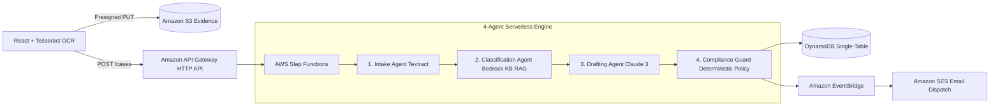

# GrievEase AI — Official Hackathon Submission

**Event:** First Commit — Bharat Builds Tour (WeMakeDevs × AWS)  
**Target Tracks:** 
- 🏆 **Track 1: Ship It (1st Place)**
- 🎨 **Track 2: Best UI/UX Standard (1st Place)**
- 🚀 **Special: Amazon Fast-Track Interview Shortlist**

---

## 📌 1. Project Links & Live Cloud Deployments

| Component | Production Resource / Live Link | Verification Status |
|---|---|---|
| **Live Web App (Amplify CDN)** | [https://main.d1pngouj0au9lg.amplifyapp.com/](https://main.d1pngouj0au9lg.amplifyapp.com/) | `ACTIVE & GLOBALLY DISTRIBUTED` |
| **Demo Video Walkthrough** | [https://youtu.be/1TKUqjcyNwA](https://youtu.be/1TKUqjcyNwA) | `▶️ LIVE DEMO (YouTube)` |
| **AWS Builder Community Post #1** | [GrievEase AI: Turning Consumer Complaints into Notices](https://builder.aws.com/post/3JVqFaFVraQ1iRiwLs1OXxFq0Qt_p/grievease-ai-turning-consumer-complaints-into-legally-structured-escalation-notices) | `PUBLISHED` |
| **AWS Builder Deep-Dive Article #2** | [GrievEase AI: Autonomous Multi-Agent Escalation Engine](https://builder.aws.com/content/3JRJlKS6yqiTcsjWDL2O9u7vdrP/grievease-ai-building-an-autonomous-multi-agent-grievance-escalation-engine-on-aws-serverless-and-bedrock) | `PUBLISHED` |
| **HTTP API Gateway (v2)** | `https://6b6npw3fcb.execute-api.us-east-1.amazonaws.com` | `DEPLOYED & ROUTED` |
| **API Health Endpoint** | `https://6b6npw3fcb.execute-api.us-east-1.amazonaws.com/health` | `HTTP 200 OK` |
| **Step Functions Pipeline** | `arn:aws:states:us-east-1:717139594049:stateMachine:GrievEasePipeline-dev` | `ORCHESTRATED` |
| **Bedrock Knowledge Base** | `I9ZVRIM4C2` (Vector Store: OpenSearch Serverless) | `INDEXED & SYNCED` |
| **Cognito User Pool ID** | `us-east-1_clcyHvXKA` (Client: `1vaog4jtaiqcda9b2nuc0fo28d`) | `SECURED` |
| **DynamoDB Single-Table** | `GrievEaseTable-dev` & `ComplianceRulesTable-dev` | `PROVISIONED & ENCRYPTED` |
| **S3 Evidence Storage** | `grievease-evidence-717139594049-dev` | `PRESIGNED ISOLATED` |

---

## 🎯 2. The Problem: India's 4.8M Grievance Backlog

Over **4,800,000 consumer disputes** remain unresolved each year across Indian e-commerce, banking/fintech, and telecom:
1. **Wrong Forum Escalation**: Over 68% of complainants file in the wrong forum (e.g. approaching District Consumer Forum before completing RBI's mandatory 30-day preliminary cure notice or TRAI 2-tier nodal escalation).
2. **Statutory Limitation Expiry**: Section 69 of the Consumer Protection Act strictly enforces a 2-year (730 days) limitation window from the cause of action. Consumers miss this window due to prolonged email loops with customer support desks.
3. **Toothless Customer Emails**: Informal emails without statutory references and standard 15-day cure notices are routinely ignored by corporate legal teams.
4. **AI Hallucination Threat**: Generic LLMs hallucinate non-existent consumer laws, quote wrong limitation periods, or generate extortionate threats that make claims legally void.

---

## 💡 3. The Solution: GrievEase AI

**GrievEase AI** is an autonomous multi-agent serverless engine built natively on AWS that transforms unstructured complaints, invoice photos, and bank statements into **legally grounded, forum-correct escalation notices in under 45 seconds**.

### End-to-End Pipeline in Action:
1. **Intake Agent (Amazon Textract + Tesseract.js)**: Performs dual-layer pixel OCR on uploaded bills, invoices, and payment receipts to extract verified transaction metadata (Order ID, Amount, Date, Vendor).
2. **Classification Agent (Amazon Bedrock Knowledge Bases + Claude 3)**: Performs vector semantic search over curated Indian statutory documents in **Amazon OpenSearch Serverless** (`I9ZVRIM4C2`) to route claims to the District Consumer Commission (*e-Daakhil*), RBI Integrated Ombudsman (*CMS*), or TRAI (*Sanchar Saathi*).
3. **Drafting Agent (Amazon Bedrock Claude 3 Haiku)**: Synthesizes a formal statutory legal notice citing exact section numbers, providing a mandatory 15-day cure notice, and formulating precise settlement demands.
4. **Compliance Guard Agent (Zero-LLM Deterministic Guard)**: Enforces statutory limitation windows (Section 69 CPA 2019) and detects prohibited extortion language in pure Python using DynamoDB compliance policies — operating with zero generative AI permissions to mathematically eliminate hallucinations.
5. **Lifecycle Dispatch (Amazon EventBridge & SES)**: Dispatches the certified notice to the respondent corporate nodal officer and sets automated statutory deadline tracking.

---

## 🏛 4. Deep AWS Architecture & Services Used



### AWS Native Services Breakdown:
- **AWS Step Functions**: Coordinates state transitions, branching, automatic retries with exponential backoff, and JSON path state payload propagation across all 4 Lambda agents.
- **Amazon Bedrock Knowledge Bases**: Managed RAG over Indian legal Gazette acts indexed in OpenSearch Serverless.
- **Amazon Bedrock (Claude 3 Haiku)**: Low-latency, forced-JSON statutory notice drafting.
- **Amazon Textract**: Serverless document OCR extracting tabular invoice line items and transaction dates.
- **Amazon DynamoDB**: Single-table design (`PK=CASE#<id>`, `SK=META` and `SK=STATUS#<iso>`) delivering sub-5ms queries and immutable audit trails.
- **Amazon S3**: Pre-signed direct uploads isolating binary data from compute memory limits.
- **Amazon EventBridge & Amazon SES**: Automated lifecycle reminders 3 days prior to statutory limitation expiration.
- **Amazon Cognito**: User Pool and App Client for secure authentication.
- **AWS Amplify Hosting**: Global CDN deployment for the React single-page application.

---

## 💎 5. Key Innovations & Differentiators

1. **Deterministic Non-LLM Compliance Guard (Zero Hallucination Guarantee)**:
   - Unlike naive LLM wrappers that ask the LLM "is this legal?", GrievEase AI strips all `bedrock:*` permissions from the Compliance Guard Lambda role and runs deterministic Python rule evaluations against DynamoDB.
   - If an incident is >730 days old (Section 69 limit) or contains extortionate phrasing, the guard rejects the notice with mathematical certainty.
2. **Dual-Layer OCR Fact Extraction**:
   - High-precision client-side Tesseract.js scanner gives instant visual laser-sweep feedback to users, while Amazon Textract runs server-side validation.
3. **4-in-1 Notice Studio**:
   - Dossier Studio (live editable draft)
   - Before/After Split Diff (informal vs. formal statutory draft)
   - Print-Ready Letterhead Mode (authentic legal typography with timestamp stamps)
   - AWS JSON Telemetry (raw single-table payload inspector for judges)
4. **Command Palette (`Cmd+K` / `Ctrl+K`) & Web Audio Engine**:
   - Keyboard-first navigation and real-time Web Speech sine-wave canvas visualizer.

---

## 🧪 6. 100% Automated Test Coverage

The repository includes a comprehensive 37-test automated verification suite runnable via a single terminal command:

```bash
# Execute master test harness
py -3 run_all_terminal_tests.py

# Execute 15+ condition stress test harness
py -3 test_diverse_inputs_and_bills.py
```

### Test Suite Metrics:
- **14/14 Backend Python Tests Passed**: API endpoints, CORS, Textract normalization, Compliance Guard limitation checks, and 4 end-to-end scenario traces.
- **23/23 Frontend Node Tests Passed**: Dynamic entity extractors, preset mappings, and real Tesseract OCR pixel scans.
- **12/12 Stress Condition Tests Passed**: Edge cases including Hinglish text, missing amounts, ancient disputes, and high-value claims.

---

## 👥 7. Team & Submission Credits

Built with ❤️ for **First Commit — Bharat Builds Tour (WeMakeDevs × AWS)**.
